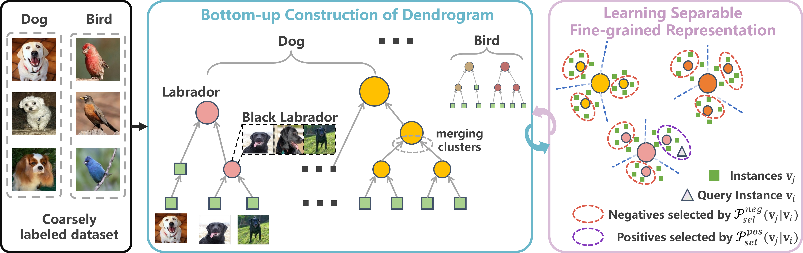

# 2025_ICCV_BuCSFR
# Learning Separable Fine-Grained Representation via Dendrogram Constructionl from Coarse Labels for Fine-grained Visual Recognition

This repo contains PyTorch implementation of the BucSFR. BucSFR is a method that learns fine-grained representations form coarsely labeled datasets without any supervision at the fine-grained level. For more details please check our paper [BucSFR](https://iccv.thecvf.com/virtual/2025/poster/767).




---

# Installation

Setup the conda environment and install the required packages by running the following commands:

```sh
conda env create -n BuCSFR -f requirements.txt
conda activate BuCSFR
```


---

# Dataset Preparation

- For **ImageNet32**, we followed the repo [MaskCon](https://github.com/MrChenFeng/MaskCon_CVPR2023/tree/main/datasets);
- For **CIFAR100**, **CIFAR10** and **Stanford Cars**, it will download the datasets automatically in your input path;
- For **iNaturalist2019**, we followed this repo [Making Better Mistakes](https://github.com/fiveai/making-better-mistakes);
- For FGVC datasets, please download them from the official website:
  - [FGVC-Aircraft](https://www.robots.ox.ac.uk/~vgg/data/fgvc-aircraft/)
  - [CUB200-2011](https://www.vision.caltech.edu/datasets/cub_200_2011/)
  - [Oxford Flowers102](https://www.robots.ox.ac.uk/~vgg/data/flowers/102/)
  - [NABirds](https://dl.allaboutbirds.org/nabirds)


---

# Training

To train BuCSFR , please run the following command in the [train.sh](train.sh). For example, to train BucSFR on the CIFAR100 dataset, run:

```sh
CUDA_VISIBLE_DEVICES=0,3 python main.py --dist-url tcp://localhost:10009 --multiprocessing-distributed --world-size 1 --rank 0 
--dataset cifar100 --arch resnet50 --img_size 224 --lr 0.03 --batch-size 256 --moco-k 65536 --moco-t 0.2 
--data 'your data path' 
--exp_dir ./experiment/cifar100 
--warmup_epoch 10 --epochs 100 --workers 8 --mlp --aug-plus --cos 
| tee -a zz_cifar100.log 
```


---

# Citation

If you find our code useful, please consider citing:

```markdown
Please wait for the official report.
```

